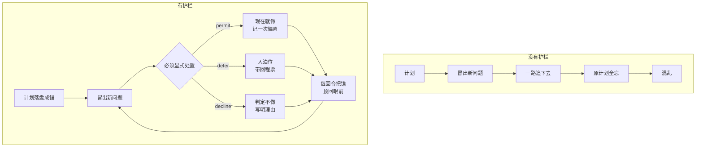

# plan-anchor · 计划锚

> 一个**防漂移护栏**：把 AI 的多步计划从「上下文里的临时文字」变成「磁盘上的持久锚」。
>
> 仓库：<https://github.com/Paeonia-wh/paeonia-plan-anchor>


---

## 它治什么病

> "执行其中一规划的时候又发现了很多其他的问题，然后就**一路沿着其他的问题进行下去了**，
> 导致**其他的规划全忘记了，并且混乱了**"
>
> —— 这是这个项目的起点，来自使用者本人的原话

拆开是四步：`① 发现新问题 → ② 一路追下去 → ③ 原计划全忘了 → ④ 混乱`

**这个工具打的是 ③，并给 ② 提供了一个更好的选项。它不打 ① 和 ②** —— 因为"发现问题就去处理"本身不是罪，有时候那个问题就是阻塞。

## 核心理念

> ### 偏离可以，沉默不行。

几乎所有的"防跑偏"工具都在试图**禁止偏离**。这个工具不这么干 —— 它禁止的是**静默地偏离**：
不记得原计划、没人知道你在偏、偏出来的东西没归属。



## 它做什么

| 机制 | 说明 |
|---|---|
| **计划落盘成锚** | 计划与步骤写进本地 SQLite，跨会话、跨上下文压缩存活 |
| **回合重放锚** | 每一轮对话把锚放回上下文 —— **这是它最承重的部分** |
| **新发现先入泊位** | 中途冒出的问题必须显式处置：`permit` / `defer` / `decline`，**不许默默切换** |
| **回程票** | 被判"暂不做"的事带上「什么时候回来处理」；到条件了**主动提醒**，而且绑定**步骤身份** —— 中间插入/删除步骤也不会指错 |
| **漂移预算** | 连续多轮没推进就提醒；而 AI 若确实在做当前步的长活，可用「在轨声明」把预算清零 |
| **完成闸门** | 最后一步做完**不许自称完成** —— 必须先问过用户（用"用户是否真的发过言"这个**可观测事实**硬判） |
| **计划演化** | 改一步 / 插一步 / 丢一步 / 返工旧步骤，**都不丢进度、编号不乱**；已完成区冻结，只能被"取代"不能删 |
| **额外步骤** | 用户中途要你做的事，用 `plan_detour` 开成一条额外步骤：主线当前步**自动挂起**，做完 `plan_step_done` **自动回来**；**不计偏离额度**（要做的活 ≠ 跑偏） |
| **等待** | 「在等外部」是一个**显式状态**，而且**三要素缺一不可**：等什么 / 什么算等到了 / **超时之后干什么**。等待期间不涨漂移预算（等外部不是你的错，**等自己才是漂移**） |
| **紧急闸门** | 「紧急」是要求打断计划 —— 所以**判定权不在 agent 手上**：必须给理由（拖延的代价），**且必须经用户批准**。谁能宣布紧急，谁就能随时插队；**受益者不该同时是裁判** |
| **验收步** | 步骤分两类：**要做的活** 与 **请你验收的**（后者不占进度、单独一节显示）。混在一起会让人以为"看我先表态"是要干的活 |

## 真实输出长什么样

> 下面这些**格式是插件真正打印的格式**（不是示意图），示例内容统一用一个虚构的 Docker 项目，
> 方便你看清每一行是什么。

**回合锚** —— 每回合把计划放回眼前。注意它会**自适应**：状态变了给全的，没变就缩短，
一直不变就改成质问（一个只重复的提醒，第 10 次之后就会失效，所以它不许自己变成墙纸）。
**进度只数"要做的活"，验收步骤单独一节**：

```
【计划锚】把电梯 demo 上 Docker｜工作步 1/6 完成｜要做：写 Dockerfile（验收：docker build 通过且镜像 <200MB）｜泊位 1 条未处理
```
```
【计划锚】把电梯 demo 上 Docker｜工作步 3/4 完成｜要做：写 compose 编排（验收：docker compose up 后三个服务 healthy）｜👁 待你验收 1 项｜泊位空（与上回合相同，已缩短）
```
```
⚠【计划锚】**计划已经 3 回合没有任何变化** —— 还停在这里：
📊 这条质问问过 3 次，其中 2 次有响应（遵守率 67%）—— **当前这一次还没回应**
   第 4 步「本地跑通」（工作步 3/5 完成）
这是**真的在推进**，还是**卡住了**？四选一：
  · 在推进**这一步** → `plan_note` 说一句进展（预算清零）
  · **在做用户另外要的事**（不是这一步）→ `plan_detour` 把它开成一条额外步骤：主线挂起、做完自动回来、**不计偏离**
  · 卡住了 → `plan_discover` 处置，或 `plan_amend` 改这一步
  · 不想做了 → `plan_drop` 丢掉它 / `plan_set` 换计划
```

**泊位清单** —— 每条欠账都带"什么时候回来处理"：

```
🅿 泊位清单（1 条待处理 / 共 2 条）
- 泊位 1 [待处理] 镜像体积 1.2G，需要多阶段构建优化（第 3 步时发现）｜🔄 重启条件：计划走完之后
- 泊位 2 [已完成] 告警通道还没定（第 1 步时发现）
```

**等待**（三要素 + 两条出边）—— 到点**真的会把它叫回来**：

```
⏸【计划锚】在等：等 CI 流水线跑完｜等到：CI 返回结果｜第 8/8 回合｜（第 5 步挂着）
```
```
⏰【计划锚】**你等的「等 CI 流水线跑完」已经 9 回合没动静了。**
   唤醒条件：CI 返回结果
   当初说好超时之后：**先按本地构建结果继续，别一直干等，回头再补一次 CI 验证**
现在按当初说好的办，别继续干等。
（等待有两条出边：**唤醒** 或 **超时**。你现在走到超时这边了。）
```

**额外步骤** —— 用户中途要的活，主线挂着、做完自动回来：

```
【已开一条额外步骤 1】给这个项目做一套宣传图
理由已记录：用户刚要求的
主线第 3 步「写 compose 编排」已挂起 —— 做完这条 plan_step_done 会**自动回到它**。
（额外步骤**不计偏离额度**：它是「要做的活」，不是「跑偏」。）
```

**紧急闸门** —— 未经用户批准**不生效**，并给出可直接照抄的问句：

```
⏸ **紧急 = 要求打断计划 → 这个判定权不在你手上。**
   发现：发现 token 泄露
   拖延的代价：泄露的密钥若被扫到会直接造成损失
**先问用户**，把这个问句照抄给他：
   「我发现一个紧急问题：发现 token 泄露。拖延的代价是：……要现在停下主线去修它吗？」
用户同意后，**把用户的原话抄进 user_said** 再调一次
（设计理由：紧急是最容易被滥用的借口 —— 受益者不该同时是裁判。）
```

**回程票到期** —— 它自己举手，不靠 AI 记得：

```
⏰ 回程票到期：泊位 3「日志格式不统一」—— 当初写的是「计划走完之后」，现在到了
```

**给 AI 用的明细** —— 每步的依据、修订史、可核的记录：

```
【计划锚】把电梯 demo 上 Docker｜工作步 3/5 完成
▶ 要做：写 compose 编排（验收：docker compose up 后三个服务 healthy）
主线步骤：
  ✔ 第1步 写 Dockerfile · 依据：docker build 通过且镜像 180MB……
  ▶ 第3步 写 compose 编排
计划修订史（最近 5 次）：
  15:51:40 插入 after 第14步 · 在主线第 14 步之后插入了 4 步；编号顺延：「…」第15→第19步（步骤身份与完成状态跟着 id 走，没有被带跑）
```

## 为什么不是"提示词纪律"

**因为提示词是"社会契约"，而契约是可以说服的。** 这个工具把关键约束放到**代码**里：

| 不变量 | 强制层 |
|---|---|
| 新发现必须显式判定，无判定即拒 | `code` |
| 计划不可静默覆盖，必须带 reason | `code` |
| 台账由代码自动追加，不接受 AI 手工写 | `code` |
| 泊位条目**永不自动消失**，只有显式关闭才关闭 | `code` |
| **完成闸门**：最后一步做完不许自称完成 | `code` |
| **回合开始把锚放回上下文** | `prompt_only` ← **唯一只能靠注入实现的一条，明确标注，不假装它是硬约束** |

完整的 I1–I12 见 [`SPEC.md`](SPEC.md) 第 1 节，每条都标了强制层。

## 这些做法有实证支撑（不是我们的直觉）

围绕「AI 到底跟不跟它自己的计划」，有一篇目前最系统的实证研究：

**《From Plan to Action: How Well Do Agents Follow the Plan?》**
Shuyang Liu, Saman Dehghan, Jatin Ganhotra, Martin Hirzel, Reyhaneh Jabbarvand
[arXiv:2604.12147](https://arxiv.org/abs/2604.12147) · 21,120 条轨迹 · SWE-agent · 4 个模型 · 8 种计划变体

**四条直接相关的发现（原文）：**

| 论文发现 | 对应本项目的什么 |
|---|---|
| *"Without an explicit plan, agents fall back on **internalized workflows** during training, which are often **incomplete, overfit, or inconsistently applied**"* | **计划必须显式落盘**（本项目的第 1 条机制） |
| *"**periodic plan reminders** can **mitigate plan violations** and improve task success"* | **回合锚**（本项目的第 2 条机制）—— 这是它有力的外部依据 |
| *"A subpar plan hurts performance **even more than no plan at all**"* | 立计划时强制写「怎么算做完」（验收标准），缺了会被点出来 |
| *"inserting additional task-relevant phases in the early stage **can degrade performance**, particularly when these phases do not align with the model's internal problem-solving strategy"* | **计划演进度量**：把「计划长了多少」变成一个看得见的数字（见下） |

### 关于"计划膨胀"，我们用的是论文的度量公式

论文为了量"agent 跟了多少计划"，定义了三个维度并用**几何平均**汇总：

```
PC = (PPC · POC · PPF)^(1/3)
```

原话：*"Geometric mean aggregates sub-metrics multiplicatively, ensuring **equal weighting and preventing compensation** across dimensions."*
（用几何平均而不是算术平均 —— **一个维度烂，总分就得烂**，避免"某维满分"把"另一维零分"补回来。）

**我们把它整体搬了个位置**：论文量的是「**轨迹 vs 计划**」，我们量「**最初计划 vs 现行计划**」：

| 维度 | 本项目里的含义 |
|---|---|
| **PPC′ 覆盖** | 最初的步骤**还有几个活着** |
| **POC′ 顺序** | 最初步骤的相对顺序**有没有被打乱**（用最长递增子序列，和论文一样） |
| **PPF′ 保真** | 现行计划里**有多少是原来就有的** |
| **膨胀率** | `1 − PPF′` |

**判据是稳定的步骤 id**，不是文字比对 —— 所以「4 步变 4 步、其实全换了一批」也能被识别（膨胀率 50%），而只记步数的做法会说"没膨胀"。

> 论文也把立场说清楚了：*"Including additional actions beyond those in the recommended plan is **not necessarily negative, but can be distracting**."*
> 所以这是**度量**，不是判罪 —— 我们引用它，也是这个用法。

## 它**不**治什么（请先看这个）

1. **只在 AI 主动申报时有效** —— 它看不见"根本没申报的那件事"
2. **不能阻止跑偏**，只能让跑偏**不被忘记、不被隐藏**
3. **防不住改数据库** —— 能改你磁盘文件的程序，没法用同一磁盘上的东西约束它
4. **不判断"做得对不对"** —— 验收是语义判断，留给人

完整边界见 [`SPEC.md`](SPEC.md) 第 7 节。

## 装

**别自己照文档敲命令 —— 把 [`AI-INSTALL.md`](AI-INSTALL.md) 交给你的 AI，让它先问你、再装。**

那份文件是**写给 AI 看的**：里面有一段可以直接照抄来问你的话、一份"装了会改动什么"的逐项清单、以及怎么卸载。

> 这是刻意的设计：安装本身是**不可逆动作**（改配置、建数据库），所以它必须**先问过你**。
> 这个工具卖的就是"不许静默动手"，那它自己装的时候也不许。

## 验证装成功了

重启宿主后，在任意项目目录里让 AI 调一次 `plan_status`，应看到：

```
【计划锚】当前没有生效的计划。
（本项目作用域：<那个目录>）
```

**看到"作用域"那一行 = 它在工作，而且知道自己在哪个项目里。**

## FAQ

**会不会很烦？**
做了四件事防这个：单发操作**零噪声**（不立计划就不打扰）；静默**有时限**（到期自动恢复，并温和问你一句）；提醒**语气三档**（normal / strict / soft）；而且**锚没变化时会自己缩短**、连续几回合不变会改成质问而不是复读。

**能不能关？卸载干净吗？**
干净。`plan.db` 在 `$DSH_HOME/plan-anchor/` 下，**不在你的项目里**；插件不在你的代码仓库留任何东西。卸载步骤见 [`AI-INSTALL.md`](AI-INSTALL.md) 第 7 节。

**和 Task-Anchor 之类的工具有什么区别？**
那些是**单任务锁**（一次只准干一件事）。这个工具管的是**多步计划的演化**：改计划不丢进度、编号不乱、已完成区冻结、被取代的旧步骤留痕。粒度不同，不是替代关系。

**它能看到我所有对话吗？会联网吗？**
不联网、不上传。它只在**本地**判断两样东西：**工具调用序列**（用来算漂移预算）和**用户消息里的信号**（用来判断"你是不是在叫停 / 问进度 / 要整理"）。

**为什么有中文词表？英文方案不能直接用吗？**
不能，会踩坑。中文没有空格，**短词会被惯用法吃掉**：实测「等等」70 次里 87% 其实是"诸如此类"、只有 8 次是"等一下"；`先不` 会命中"先**不管** / 先**不说**"。所以"等一下"能当信号，"等等"不能。词表与频次见 [`research/drift-signals-zh.md`](research/drift-signals-zh.md)（**只保留词与频次，不含任何用户原话**）。

**它自己会不会出错？**
会，而且它**承认**：护栏自身出错时会写 `护栏自身错误` 台账并打宿主日志（**静默失败是最坏的失败** —— 同时具备"没报错"和"没生效"，谁都查不出来）。红队审计记录见 [`research/plan-anchor-redteam.md`](research/plan-anchor-redteam.md)。

## 仓库里有什么

| 路径 | 是什么 |
|---|---|
| [`AI-INSTALL.md`](AI-INSTALL.md) | **给 AI 的安装说明**（先问用户 / 会改动什么 / 怎么卸载） |
| [`SPEC.md`](SPEC.md) | **规范**：不变量 I1–I12（逐条标强制层）、三值处置、问询判据、信号词表 |
| [`DESIGN.md`](DESIGN.md) | 设计推演：为什么这么设计、证据、被否掉的替代方案 |
| [`AGENTS.md`](AGENTS.md) | 纪律层（别的宿主可直接当 `rules` / `AGENTS.md` 用） |
| [`dsh/`](dsh/) | **参考实现**（DSH 插件本体） |
| [`tests/`](tests/) | **362 项断言** + 极端场景仿真 |
| [`research/`](research/) | 调研与红队审计（**不含用户原话**） |
| [`adapters/`](adapters/) | 怎么移植到别的宿主（MCP / Claude Code / Codex） |

## English summary

**plan-anchor** is a drift guard for AI agents running multi-step plans. It persists the plan to disk
as a durable anchor, re-injects that anchor every turn, and forces every mid-task discovery to be
explicitly disposed of (`permit` / `defer` / `decline`) instead of being silently chased. Design
position: **deviation is allowed, silence is not.**

It ships as a DSH plugin reference implementation plus a portable [spec](SPEC.md). The
[install guide](AI-INSTALL.md) is written for an AI agent and requires it to ask the user before
installing. Hard invariants live in code, not in prompt instructions — and the one invariant that
cannot be (turn re-anchoring) is explicitly labelled `prompt_only` rather than pretending otherwise.

## License

MIT
